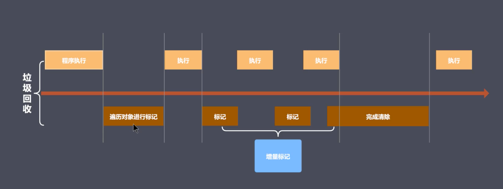

### JS 性能优化

性能优化不可避免，所有能够提高程序运行效率的操作都可以看做是优化，以下将主要说明前端在 JS 性能方面的优化

- 内存管理
- 垃圾回收与常见 GC 算法
- V8 引擎的垃圾回收
- Performance 工具
- 代码优化实例


---


#### 内存管理

##### 内存管理原因

程序都是在内存中运行的，如果不及时对内存进行回收、释放，有可能导致内存泄漏、内存用尽，影响程序正常运行

##### 内存管理介绍

- 内存：由可读写单元组成，表示一片可操作空间
- 管理：人为的去操作一片空间的申请、使用和释放
- 内存管理：开发者主动申请空间、使用空间、释放空间
- 管理流程：申请——使用——释放

##### JS 中的内存管理

```js
// 申请
let obj = {}

// 使用
obj.name = 'lg'

// 释放
obj = null

```


---


#### JS 中的垃圾回收

##### JS 中的垃圾

- JS 中内存管理是自动的
- 对象不再被引用时是垃圾
- 对象不能从根上访问到时是垃圾

##### JS 中的可达对象

- 可以访问到的对象就是可达对象（引用、作用域链）
- 可达的标准就是从根出发是否能够被找到
- JS 中的根就可以理解为是全局变量对象

```js
// reference

let obj = { name: 'xm' } // xm 对象空间 被 obj 引用，从全局角度来看，obj 此时可达

let ali = obj // xm 对象空间此时多了一次引用

obj = null // xm 对象空间此时失去了 obj 对其的引用，但 xm 对象空间仍然是可达的，因为 ali 仍保持着对 xm 对象空间的引用

```

```js
// 可达
function objGroup (obj1, obj2) {
  obj1.next = obj2
  obj2.prev = obj1
  
  return {
    o1: obj1,
    o2: obj2
  }
}

let obj = objGroup({
  name: 'obj1'
}, {
  name: 'obj2'
})

console.log(obj)
/*
{
	o1: {
		name: 'obj1',
		next: {
			name: 'obj2',
			prev: [Circular]
		}
	},
	o2: {
		name: 'obj2',
		prev: {
			name: 'obj1',
			next: [Circular]
		}
	}
}
*/

// 如果此时执行
delete obj.o1
delete obj.o2.prev
// 此时无法通过任何途径访问到 obj1 对象空间，obj1 此时不可达，会被视作垃圾，将被回收
```


----


#### GC 算法介绍

- GC 可以找到内存中的垃圾、并回收和释放空间

- GC 是一种机制，垃圾回收器完成具体的工作
- 工作的内容就是查找垃圾释放空间、回收空间
- GC 算法就是垃圾回收器工作时查找和回收所遵循的规则


#### 常见 GC 算法

- 引用计数
- 标记清除
- 标记整理
- 分代回收


##### 引用计数算法实现原理

核心思想：在内部维护一个引用计数器，给变量设置引用数，判断当前引用数是否为0

关键在于：

- 引用计数器
- 引用关系改变时修改引用数字
- 引用数字为0时立即回收

```js
// reference count

function fn () {
  const num1 = 1
  const num2 = 2
}

fn()
// fn 执行完毕后，外界无法引用 num1 num2，引用数都为 0，所占内存空间被回收
```


##### 引用计数算法的优缺点

优点

- 发现垃圾时立即回收
- 最大限度减少程序暂停

缺点

- 无法回收循环引用的对象
- 时间开销大

```js
function fn () {
  const obj1 = {}
  const obj2 = {}
  
  obj1.name = obj2
  obj2.name = obj1
  
  return 'I am a coder'
}

fn()
// fn 执行完毕之后，由于 obj1 和 obj2 相互引用，如果使用引用计数算法，二者引用数都不为零，所占内存空间无法被回收，造成内存泄漏
```


##### 标记清除算法实现原理

核心思想：分标记和清除两个阶段完成，回收相应的空间

- 第一阶段：遍历所有对象找标记活动对象
- 第二阶段：遍历所有对象清除没有标记的对象（同时抹除第一阶段中的所有标记，以便下次 GC 可以再次标记）

##### 标记清除算法优缺点

优点

- 可以解决对象循环引用的回收操作

缺点

- 容易造成空间碎片化（回收的垃圾对象其本身在地址上是不连续的）


##### 标记整理算法实现原理

标记整理可以看做是标记清除的增强，同样分为标记、清除两个阶段完成

- 标记阶段的操作和标记清除算法一致
- 清除阶段会先执行整理，移动对象位置


清除阶段操作：

- 回收前

| 活动 |    | 活动 | 非活动 | 活动 |
|---|---|---|---|---|
| 活动 | 非活动 | 活动 | | 活动  |
|     | 活动 |     | 非活动 |     |
| 活动 |     | 活动 |      | 活动 |

- 整理后

| 活动 | 活动 | 活动 | 非活动 |  |
|---|---|---|---|---|
| 活动 | 活动 | 活动 |  |  |
| 活动 | 活动 | 活动 | 非活动 | 非活动 |
| 活动 | 活动 |  |  |  |

- 回收后

| 活动 | 活动 | 活动 |  |  |
|---|---|---|---|---|
| 活动 | 活动 | 活动 |  |  |
| 活动 | 活动 | 活动 |  |  |
| 活动 | 活动 |  |  |  |


> 相较于标记清除算法，标记整理算法优势在于内存空间里不会存在大批量的分散的小空间，空间是连续的


#### 常见 GC 算法总结

- 引用计数
  - 可以即时回收垃圾对象
  - 减少程序卡顿时间
  - 无法回收循环引用的对象
  - 资源消耗较大
- 标记清除
  - 可以回收循环引用的对象
  - 容易产生碎片化空间，浪费空间
  - 不会立即回收垃圾对象
- 标记整理
  - 减少碎片化空间
  - 不会立即回收垃圾对象


---


#### 认识 V8

- 一款主流的 JavaScript 执行引擎
- 采用即时编译
- 内存设限


##### V8 垃圾回收策略

采用分代回收的思想，内存分为新生代和老生代，针对不同生代的对象采用具体的算法


###### V8 中常见的 GC 算法

- 分代回收
- 空间复制
- 标记清除
- 标记整理
- 标记增量

---


##### 分代回收

- V8 内存空间一分为二（大空间和小空间）

| 新生代（小空间） | 老生代（大空间） |
| ---------------- | ---------------- |
| （From）(To)     | 老生代存储区     |


###### 新生代对象说明

- 小空间用于存储新生代对象（32M | 16M）

- 新生代指的是存活时间较短的对象（比如说，在函数执行完毕之后，函数局部作用域内的空间会被回收，对象存活时间较短，而全局作用域，可能要等到程序结束运行退出之后才会被回收）


###### 新生代对象回收实现

- 回收过程采用复制算法 + 标记整理
- 新生代内存区分为两个等大小空间
- 使用空间为 From，空闲空间为 To
- 活动对象存储于 From 空间
- 标记整理后将活动对象拷贝至 To 空间
- From 与 To 交换空间完成释放

回收细节说明

- 拷贝过程中可能出现晋升——将新生代对象移动至老生代，进行存储操作
- 晋升的标准：一轮 GC 还存活的新生代需要晋升；To 空间的使用率超过 25%


###### 老年（生）代对象说明

- 老年代对象存放在右侧老生代区域
- 64位操作系统1.4G，32位操作系统700M
- 老年代对象就是指存活时间较长的对象（比如全局作用域下的变量，闭包中放置的变量数据）


###### 老年代对象回收实现

- 主要采用标记清除、标记整理、增量标记算法
- 首先使用标记清除完成垃圾空间的回收（针对老年代空间，会采用标记清除以回收空间）
- 采用标记整理进行空间优化（当新生代对象移动到老生代存储区即晋升时，老生代存储区又不足以存放这些数据，此时会采用标记整理算法进行空间整理回收）
- 采用增量标记进行效率优化


###### 细节对比

- 新生代区域垃圾回收使用空间换时间
- 老生代区域垃圾回收不适合复制算法（数据多、消耗空间、效率低下）


###### 增量标记

